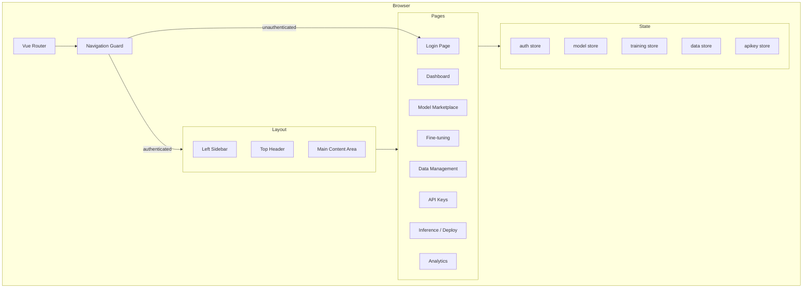

# Design Document: MaaS Platform Frontend

## Overview

本设计文档描述企业级大模型 MaaS 平台前端的完整架构与实现方案。平台参考阿里云百炼、华为云 ModelArts 的设计风格，采用 Vue 3 + TypeScript + Vite 技术栈，具备科技感暗色 UI，支持模型广场、微调训练、数据管理、API 管理、在线推理等核心功能，并为后续扩展预留清晰接口。

---

## Architecture

### 技术栈

| 层次 | 技术选型 |
|------|---------|
| 框架 | Vue 3 (Composition API) + TypeScript |
| 路由 | Vue Router 5 |
| 状态管理 | Pinia |
| UI 组件库 | Element Plus（暗色主题定制） |
| 图表 | ECharts 5 (via vue-echarts) |
| 图标 | @element-plus/icons-vue |
| HTTP 客户端 | Axios（预留，当前 mock） |
| 样式 | CSS Variables + SCSS |
| 测试 | Vitest + @vue/test-utils + fast-check (PBT) |
| 构建 | Vite 7 |

### 整体架构图



### 路由结构

```
/                    → redirect to /dashboard
/login               → LoginPage (public)
/dashboard           → DashboardPage (protected)
/models              → ModelMarketPage (protected)
/models/:id          → ModelDetailPage (protected)
/fine-tuning         → FineTuningPage (protected)
/fine-tuning/:id     → TrainingJobDetailPage (protected)
/data                → DataManagementPage (protected)
/api-keys            → ApiKeyPage (protected)
/inference           → InferencePage (protected)
/analytics           → AnalyticsPage (protected)
```

---

## Components and Interfaces

### 目录结构

```
src/
├── assets/
│   └── styles/
│       ├── variables.css       # CSS 变量（颜色、间距）
│       └── global.css          # 全局样式
├── components/
│   ├── layout/
│   │   ├── AppSidebar.vue      # 左侧导航栏
│   │   ├── AppHeader.vue       # 顶部 Header
│   │   └── AppLayout.vue       # 整体布局容器
│   ├── common/
│   │   ├── MetricCard.vue      # 指标卡片
│   │   ├── StatusBadge.vue     # 状态标签
│   │   ├── ConfirmDialog.vue   # 确认弹窗
│   │   └── LoadingSkeleton.vue # 骨架屏
│   └── charts/
│       └── LineChart.vue       # 折线图封装
├── pages/
│   ├── LoginPage.vue
│   ├── DashboardPage.vue
│   ├── ModelMarketPage.vue
│   ├── ModelDetailPage.vue
│   ├── FineTuningPage.vue
│   ├── DataManagementPage.vue
│   ├── ApiKeyPage.vue
│   ├── InferencePage.vue
│   └── AnalyticsPage.vue
├── stores/
│   ├── auth.ts
│   ├── models.ts
│   ├── training.ts
│   ├── datasets.ts
│   └── apikeys.ts
├── router/
│   └── index.ts
├── types/
│   └── index.ts                # 所有 TypeScript 类型定义
└── mock/
    └── data.ts                 # 本地 mock 数据
```

### 核心组件接口

**AppSidebar.vue**
- Props: `collapsed: boolean`
- Emits: `update:collapsed`
- 展示所有导航分组，高亮当前激活路由

**MetricCard.vue**
- Props: `title: string`, `value: number | string`, `icon: string`, `trend?: number`, `color?: string`

**AppLayout.vue**
- 包含 AppSidebar + AppHeader + `<router-view>`
- 管理 sidebar 折叠状态

---

## Data Models

```typescript
// src/types/index.ts

export interface User {
  id: string
  username: string
  role: 'admin' | 'user'
}

export interface Model {
  id: string
  name: string
  description: string
  category: ModelCategory
  tags: string[]
  provider: string
  parameterSize: string
  status: 'available' | 'deprecated'
  createdAt: string
}

export type ModelCategory = 'text' | 'vision' | 'audio' | 'multimodal' | 'embedding'

export interface TrainingJob {
  id: string
  name: string
  baseModelId: string
  baseModelName: string
  datasetId: string
  status: TrainingStatus
  createdAt: string
  finishedAt?: string
  config: TrainingConfig
}

export type TrainingStatus = '待运行' | '运行中' | '已完成' | '失败'

export interface TrainingConfig {
  epochs: number
  learningRate: number
  batchSize: number
  method: 'SFT' | 'DPO' | 'RLHF'
}

export interface Dataset {
  id: string
  name: string
  description: string
  type: 'text' | 'image' | 'audio' | 'multimodal'
  size: number        // bytes
  recordCount: number
  createdAt: string
}

export interface ApiKey {
  id: string
  name: string
  keyPrefix: string   // first 8 chars, e.g. "sk-abc123"
  maskedKey: string   // e.g. "sk-abc123••••••••••••"
  status: 'active' | 'disabled'
  createdAt: string
  lastUsedAt?: string
}

export interface NavItem {
  key: string
  label: string
  icon: string
  path: string
  children?: NavItem[]
}

export interface MetricSummary {
  totalModels: number
  activeJobs: number
  apiCallsToday: number
  datasetCount: number
}

export interface AnalyticsData {
  dates: string[]
  apiCalls: number[]
  tokensConsumed: number[]
}
```

---

## Correctness Properties

*A property is a characteristic or behavior that should hold true across all valid executions of a system-essentially, a formal statement about what the system should do. Properties serve as the bridge between human-readable specifications and machine-verifiable correctness guarantees.*

本节将需求中的验收标准转化为可执行的正确性属性，用于属性测试（Property-Based Testing）。

---

**Property 1: 未认证访问任意受保护路由均重定向到登录页**

*For any* protected route path, when the auth store has no authenticated user, the navigation guard should redirect to `/login`.

**Validates: Requirements 1.1, 1.4**

---

**Property 2: 非法凭据被拒绝**

*For any* username/password pair that is not exactly `admin`/`admin`, the login function should return an error result and the auth store should remain unauthenticated.

**Validates: Requirements 1.3**

---

**Property 3: 登出后会话清除（Round-trip）**

*For any* authenticated session, calling logout should result in the auth store having no user and `isAuthenticated` being false.

**Validates: Requirements 1.5**

---

**Property 4: Dashboard 指标卡片完整性**

*For any* MetricSummary data object, the rendered Dashboard should contain exactly four metric cards displaying totalModels, activeJobs, apiCallsToday, and datasetCount.

**Validates: Requirements 2.2**

---

**Property 5: 认证页面侧边栏持久存在**

*For any* authenticated route, the AppLayout component should render the AppSidebar with all six navigation groups present in the DOM.

**Validates: Requirements 2.5, 8.1**

---

**Property 6: 模型卡片渲染完整性**

*For any* Model object, the rendered model card should contain the model's name, description, category, and at least one tag.

**Validates: Requirements 3.1**

---

**Property 7: 搜索过滤正确性**

*For any* keyword string and any array of Model objects, the filtered result should contain only models whose name or description includes the keyword (case-insensitive), and no model outside this set.

**Validates: Requirements 3.2**

---

**Property 8: 分类过滤正确性**

*For any* ModelCategory value and any array of Model objects, the filtered result should contain only models whose category equals the selected category.

**Validates: Requirements 3.3**

---

**Property 9: 表单验证——空必填字段触发错误**

*For any* form submission where at least one required field is empty or whitespace-only, the validation function should return a non-empty array of error messages and the form should not be submitted.

**Validates: Requirements 4.4, 5.4**

---

**Property 10: 有效表单提交使列表长度增加1**

*For any* valid entity (TrainingJob or Dataset) creation, after the store's create action is called, the list length should be exactly one greater than before.

**Validates: Requirements 4.3, 5.3**

---

**Property 11: API Key 在列表中始终以掩码形式展示**

*For any* ApiKey object in the store, the `maskedKey` field displayed in the list should not equal the full key value (i.e., it must contain masking characters `•`).

**Validates: Requirements 6.3**

---

**Property 12: 激活导航项与当前路由匹配**

*For any* route path, the sidebar's active item key should correspond to the NavItem whose path matches the current route.

**Validates: Requirements 8.2**

---

**Property 13: 统计看板摘要卡片完整性**

*For any* AnalyticsData object, the rendered Analytics page should contain summary cards for total API calls, total tokens consumed, and active model count.

**Validates: Requirements 9.3**

---

## Error Handling

| 场景 | 处理方式 |
|------|---------|
| 登录失败 | 表单下方显示红色错误提示，不跳转 |
| 表单必填项为空 | 字段边框变红 + inline 错误文字 |
| 删除操作 | 弹出 ConfirmDialog，用户确认后执行 |
| 路由未找到 | 重定向到 /dashboard |
| 未认证访问 | 路由守卫重定向到 /login |
| 数据加载中 | 显示骨架屏 LoadingSkeleton |

---

## Testing Strategy

### 测试框架

- **单元测试 / 属性测试**: Vitest + @vue/test-utils
- **属性测试库**: `fast-check`（TypeScript 原生支持，无需额外配置）
- **E2E 测试**: Playwright（已有配置）

### 单元测试

单元测试覆盖以下内容：
- Store 的 actions 和 getters（auth、models、training、datasets、apikeys）
- 工具函数（过滤、验证、格式化）
- 关键组件的渲染行为（MetricCard、StatusBadge、AppSidebar）
- 路由守卫逻辑

### 属性测试（Property-Based Testing）

使用 `fast-check` 库，每个属性测试运行最少 **100 次**随机迭代。

每个属性测试必须使用以下注释格式标注：

```
// **Feature: maas-platform-frontend, Property {N}: {property_text}**
```

每个正确性属性（Property 1–13）对应一个独立的属性测试用例。

**属性测试覆盖的核心逻辑：**
- 路由守卫（Property 1）
- 登录验证逻辑（Property 2, 3）
- 过滤函数（Property 7, 8）
- 表单验证函数（Property 9）
- Store CRUD 操作（Property 10）
- API Key 掩码函数（Property 11）
- 导航激活逻辑（Property 12）
- 渲染完整性（Property 4, 5, 6, 13）

### 测试文件组织

```
src/
├── stores/__tests__/
│   ├── auth.spec.ts
│   ├── models.spec.ts
│   ├── training.spec.ts
│   ├── datasets.spec.ts
│   └── apikeys.spec.ts
├── utils/__tests__/
│   ├── filter.spec.ts
│   └── validation.spec.ts
└── components/__tests__/
    ├── AppSidebar.spec.ts
    └── MetricCard.spec.ts
```
